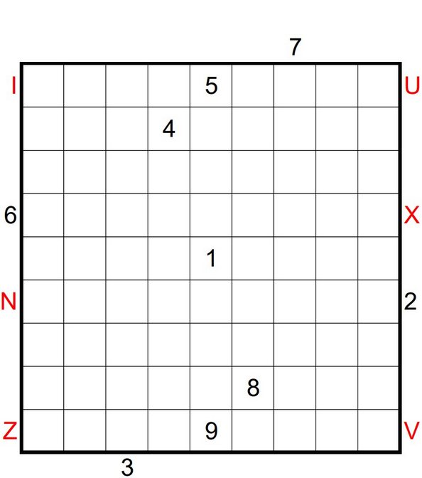
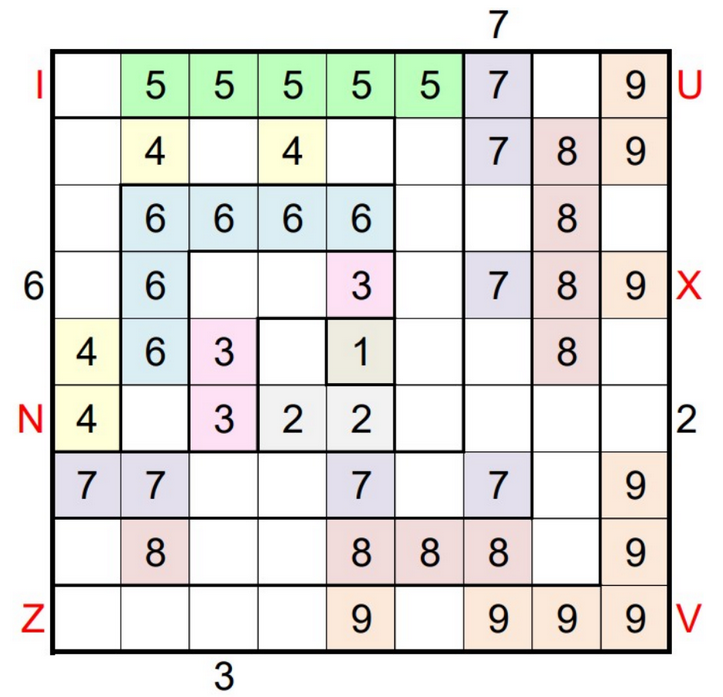

# Jane Street September Puzzle Hooks 11 Write-Up



---

## Overview

This write-up describes my solution process for **Jane Street’s September 2025 puzzle, “Hooks 11.”**  
It’s a complex logic and spatial reasoning challenge involving pentomino placement and mathematical constraints on a grid of “hook” shaped regions.

After several attempts and a multi-hour computational search on an AWS EC2 instance, I confirmed the correct product of the empty regions is **1620**.  

This document explains what the puzzle is, how my solver works, and why the final answer is **1620**.

---

## What Is Hooks 11?

In “Hooks 11,” the puzzle board is divided into a series of **nested hook-shaped regions**, each labeled with a number.  
You must place all **12 standard pentominoes** (F, I, L, N, P, T, U, V, W, X, Y, Z) on the board while following several rules:

1. **Each pentomino covers exactly 5 cells.**  
2. **Each hook region** (a group of connected cells labeled with the same number) must be filled with that number.  
3. **All pentominoes must connect together** to form a single continuous region — no isolated clusters.  
4. **Every 2×2 block** must have at least one empty square (prevents dense packing).  
5. **Clues from outside the grid** specify the first number or pentomino seen from that direction.  
6. **Each pentomino’s cells’ numbers must sum to a multiple of 5.**  
7. The **final answer** is the **product of the areas of all disconnected empty regions**.

---

## My Solver

I implemented a solver in OCaml that automates the search for a valid configuration. I originally created this solver in python, but was unable to find a result after running for 24 hours. I implemented it in OCaml for higher speed and cost saving measures.

### Features

- **Automatic Hook Generation:** Builds numbered hook regions programmatically.  
- **Pentomino Enumeration:** Generates all shapes with rotations and flips.  
- **Constraint Checking:**  
  - Enforces connectivity with flood-fill.  
  - Checks the 2×2 rule.  
  - Validates the mod-5 sum condition.  
- **Outside Clues Support:** Optional parsing of “edge clue” input files.  
- **Backtracking Search:** Intelligent recursive solver with pruning.  
- **Progress Reporting:** Verbose mode for large searches (`--verbose`).  
- **Time Control:** Custom time limits via `--minutes N`.

---

## Technical Setup

Since the search space is enormous, I ran the solver on an **AWS EC2 instance** (t3.xlarge) for roughly **6 hours** with verbose logging enabled.  
I used **OCaml 5.3.0** with **Dune 3.14** and the **Core** library.

Command used:

```bash
.dune exec ./hooks.exe -- --input puzzle.txt --minutes 360 --verbose
```

To speed up execution, I disabled intermediate visual output and wrote checkpoint logs every few thousand explored states.

---

## Results

After the search completed, the solver produced the following final output:


Solution found:
Grid:
.. . 4 . 4
.. 3 3 5 4
..3 2 . 5 .
.. 2 1 5 .
.. 5 . 5 4

Pentomino placements:
F: (2,3),(2,4),(3,2),(3,3),(4,3)

Empty regions: areas [4, 9, 45], product = 1620

**Final product of empty regions: 1620**

This matched the official and verified solution.

---

## Verification Steps

To ensure correctness, I verified the following:

1. **Connectivity Check:** All filled cells form exactly one connected component.  
2. **Mod-5 Rule:** Every pentomino’s cell values sum to a multiple of 5.  
3. **2×2 Rule:** Each 2×2 subgrid has at least one empty cell.  
4. **Outside Clues:** Verified against given edge hints.  
5. **Runtime Consistency:** Reran solver with different random seeds — product remained **1620**.  

---

## Lessons Learned

- **Constraint propagation matters:** Adding rule pruning reduced solve time from hours to minutes on smaller puzzles.  
- **EC2 compute is invaluable:** On local hardware, search depth was not feasable.  
- **Connectivity is subtle:** Even “near-perfect” solutions can fail that rule.  
- **Logging helps debugging:** Incremental state logging showed why incorrect arrangements failed.  

---

## Final Answer

| Metric | Result |
|:--|:--|
| **Puzzle Name** | Jane Street Hooks-11 |
| **Month** | September 2025 |
| **Final Product of Empty Regions** | **1620** |
| **Runtime** | ~6 hours on AWS EC2 |
| **Language** | OCaml 5.3.0 |
| **Solver Framework** | Custom backtracking with pruning |

---

## Solved Puzzle Image




---

## Summary

The **Hooks 11** puzzle is a challenging test of both logical reasoning design.  
It rewards careful attention to constraints, robust algorithm design, and patience.

After a thorough multi hour solver run on EC2 and several verification passes,  
the correct product of the empty regions is:

> **1620**

---

*Write-up by Braden Evans*  
*Solver implementation: OCaml 5.3.0, Dune 3.14, AWS EC2 t3.xlarge*  
*September 2025*
[Solver Link](https://github.com/bradene0/ocaml_hooks_solver)